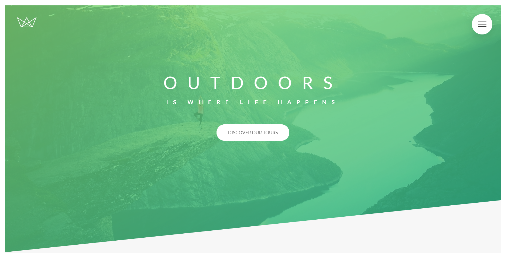
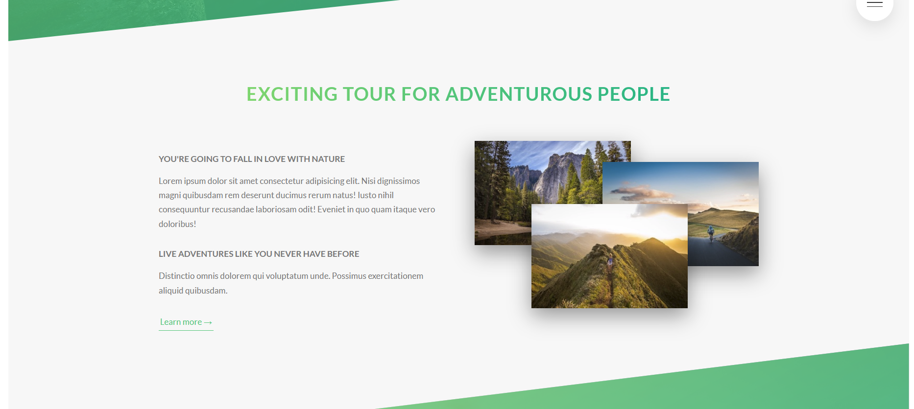
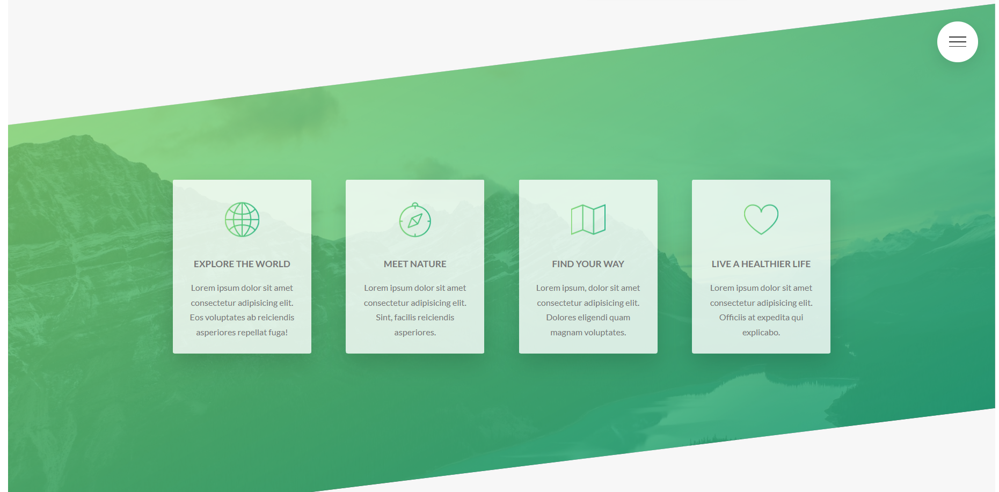
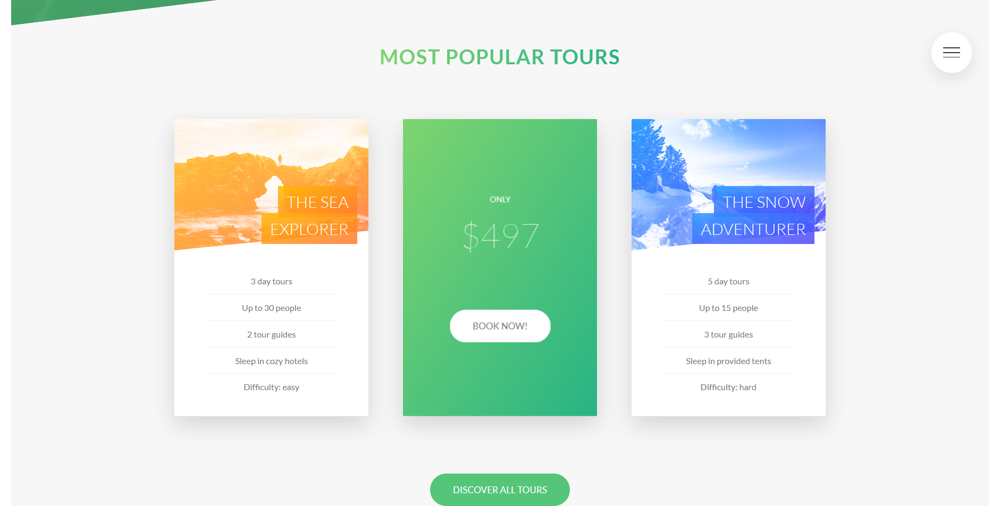
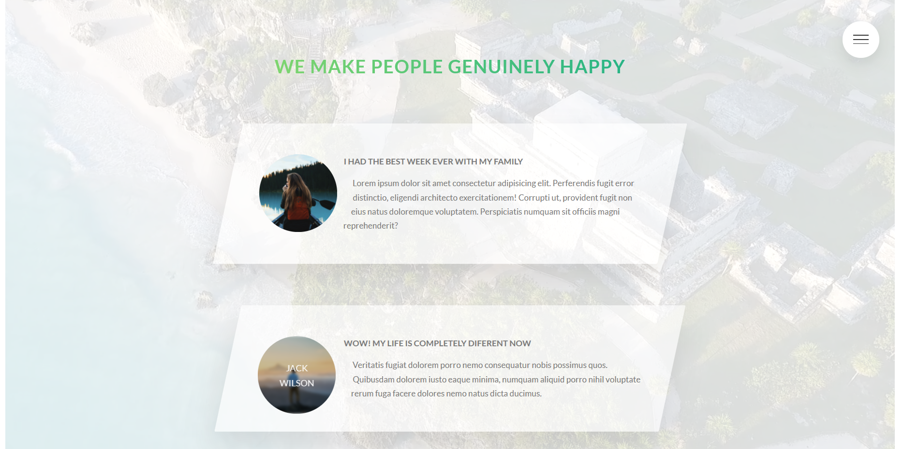
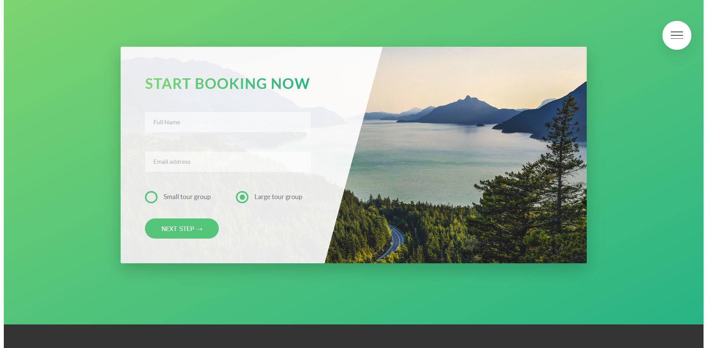

# [Natours Course Project 1](https://patriciazan.github.io/Natours-Project/)

This is the first Project from the course [Advanced CSS and Sass: Flexbox, Grid, Animations and More!](https://www.udemy.com/course/advanced-css-and-sass/) taught by Jonas Schmedtmann on Udemy.
Here I learned the fundamentals of Flexbox and continue practicing:
 - Animations;
 - Media queries;
 - Variables.

To start this project you must run in the terminal:
```
npm install
```

And to modify and acesses the page you must:
```
npm run start
```

Check the Project [HERE](https://patriciazan.github.io/Natours-Project)

_The header section and all the page_
 
 
 
 
 
 
